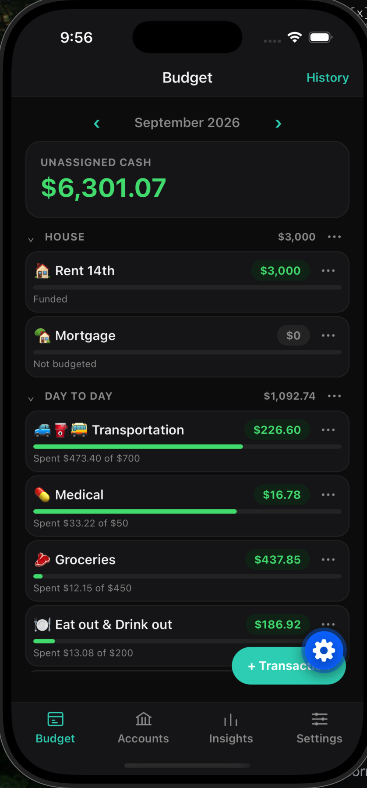
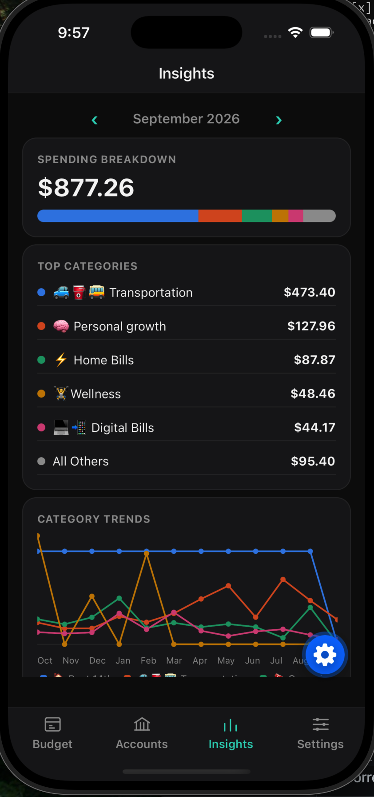

# YAMA — Yet Another Money App

> 🚧 Work in progress.

Free, privacy-first, YNAB-style budgeting for iOS. Envelope budgeting, common financial calculators, and optional AI analysis — no backend, no subscription.

See [`docs/yama-mvp.md`](docs/yama-mvp.md) for the design doc and [`docs/yama-mvp-plan.md`](docs/yama-mvp-plan.md) for the implementation plan.

## Core
- YNAB-style envelope/zero-based budgeting
- Financial tools: mortgage / interest / payment calculators
- AI analysis (bring your own API key)

## Storage
- Local (SQLite): single source of truth
- iCloud: backup option
- S3: backup option

## Privacy
- S3: provisioned by user, grant app access
- AI: user's own API key, usage auditable in the provider's own dashboard

## Development
Expo (React Native, TypeScript).

```
npm install
npm start
```

## Screenshots
 
